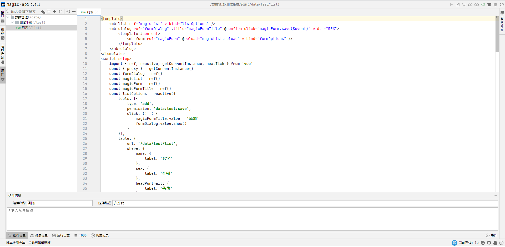
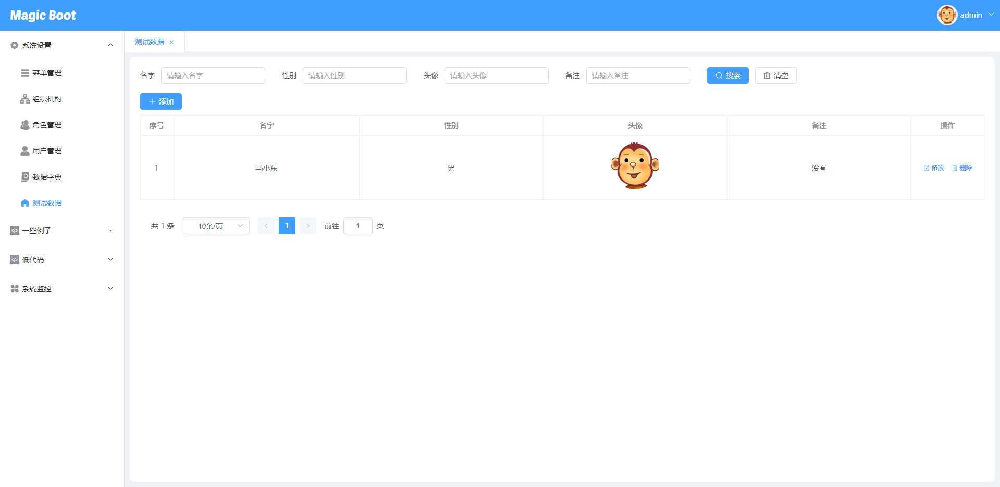

## 平台简介

基于[ **magic-api** ](https://gitee.com/ssssssss-team/magic-api)搭建的快速开发平台，前端采用Vue3 + Element Plus最新版本搭建，依赖较少，运行速度快。利用Vue3的`@vue/compiler-sfc`单文件编译，动态编译组件，可以实现在浏览器编写Vue代码，既改即生效快速开发，利用magic-api本身特性安全隔离生产和开发环境。将Vue代码以插件化的方式交给`magic-api`管理。

| 代码 | 效果 |
|----|----|
|   |   |

